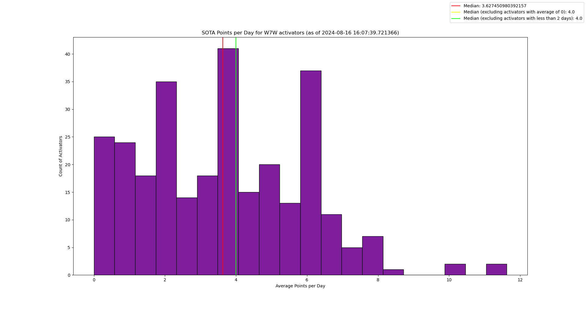
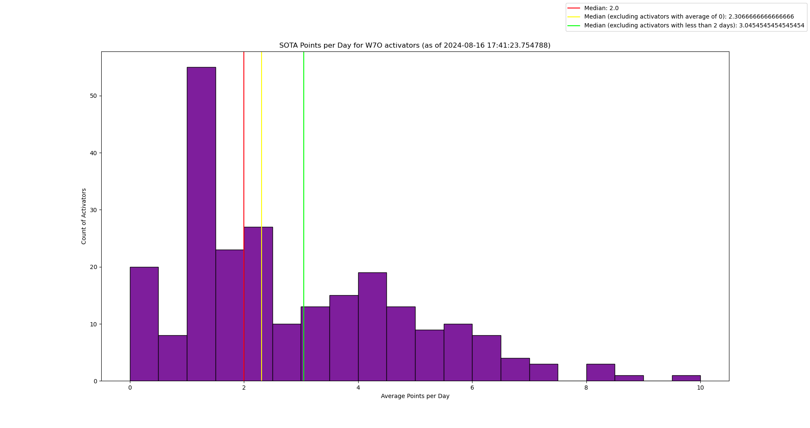
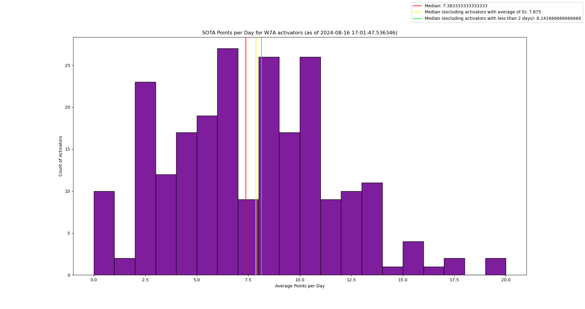

general idea:
- huge amount of data to request, probably only do this for associations in continental US (K0M + 32 starting with W)
- within an association, which activators should I use? all activators? middle 80% (by total points)? top 100? top 10%?
    - current script uses all activators
- for an individual activator, should I calculate their average or median?
    - current script uses average
- should the final value be an average of the selected activators? a median? a bar chart to show the distribution?
    - current script does bar chart to show the distribution, with a line drawn on it for the median

I like the idea of starting by downloading the log for all activators in W7W and then processing locally to see the distribution of average points per day
should I also split it up by year?

example outputs:

