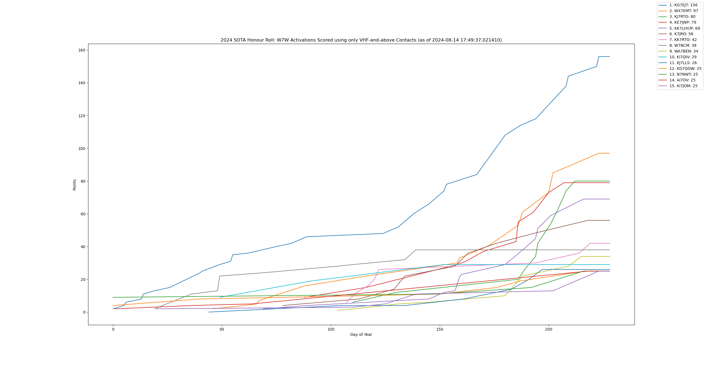

general idea:
- grab_data.py
    - request honor roll page
    - for each activator:
        - request log, save to json file
- draw_graph.py
    - iterate over log file for each activator
        - iterate over all activations, filtering out those that don't meet our criteria for points, and make a series of (day of year, SOTA points) datapoints
    - sort activators by final # of points and keep top N
    - add lines of datapoints to the graph

caveats:
    - The honor roll page only grabs activators for a single band, but the processing script filters for multiple bands. I typically download 144MHz and process for everything VHF-and-above, because at least in my association it would be very rare to have activations with any VHF-and-above band BUT not a single 144MHz contact. However, this method does possibly miss people. If you want to be exhaustive, use one of the other data grab scripts to get all activators with any points ever in the association.
    - The output from data_grab.py doesn't necessarily match the parameters passed to process_data.py. For example, you could download the 1240MHz honor roll then try to graph the data for HF-and-below contacts by accident, and you would get misleading output.

Example output:

